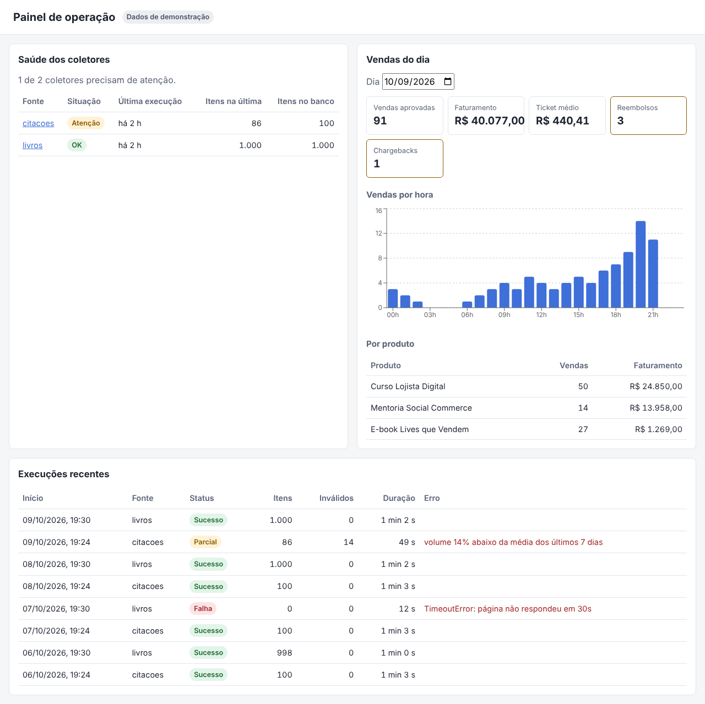
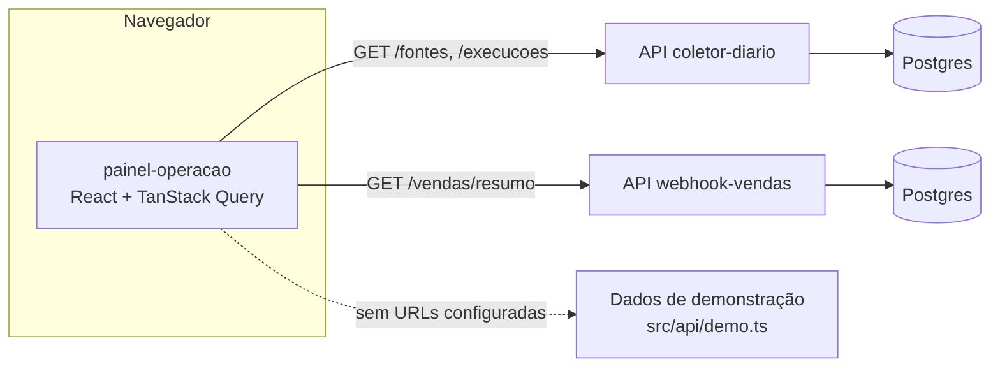

# painel-operacao

[](https://github.com/MateusGitBoss/Painel-operacao/actions/workflows/ci.yml)

Painel em React + TypeScript para quem opera a loja: mostra se o robô de coleta rodou bem ([coletor-diario](https://github.com/MateusGitBoss/coletor-diario)) e como estão as vendas do dia ([webhook-vendas](https://github.com/MateusGitBoss/webhook-vendas)).

**Para quem não é técnico:** é a tela que a equipe deixa aberta durante o dia. Em cima, uma lista dos sites que o robô visita, com um selo verde, amarelo ou vermelho dizendo se a última coleta deu certo. Do lado, quantas vendas entraram hoje, quanto faturou, os reembolsos e um gráfico por hora. Embaixo, o histórico das últimas coletas com a mensagem de erro quando algo falhou. A tela se atualiza sozinha a cada minuto.



## Como os dados chegam



O painel só lê rotas públicas e agregadas. Nenhum token vai para o navegador: tudo que está no JavaScript do front é público, então rota que exige token (como a lista de vendas com dados de cliente) não é usada aqui.

## Regras de saúde dos coletores

| Selo                      | Quando                                                                                      |
| ------------------------- | ------------------------------------------------------------------------------------------- |
| OK                        | Última execução com sucesso nas últimas 26 h                                                |
| Atenção                   | Última execução parcial (itens inválidos ou volume abaixo do normal)                        |
| Falhou                    | Última execução com falha                                                                   |
| Atrasada                  | Nenhuma execução há mais de 26 h, mesmo que a última tenha dado certo (o agendamento parou) |
| Sem execuções / Desligada | Fonte nova ou desativada                                                                    |

Problemas aparecem primeiro na tabela. Clicar no nome da fonte filtra o histórico de execuções. → `src/dominio/saude.ts`

## Como rodar

Pré-requisitos: Node 22.

```bash
npm install
npm run dev          # http://localhost:5173, em modo demonstração
```

Para usar as APIs de verdade, crie `.env.local` a partir do `.env.example` com as URLs do coletor e do webhook-vendas. As duas APIs precisam liberar a origem do painel no CORS (variável `CORS_ORIGENS` nos dois projetos).

### Testes e qualidade

```bash
npm run lint && npm run format:check
npm run typecheck
npm test             # Vitest + Testing Library, sem servidor nenhum
npm run coverage
```

Os testes trocam a fonte de dados por uma falsa (`ProvedorDados`) e testam o que o usuário vê: textos, selos, cliques e mensagem de erro com "Tentar de novo".

## Deploy na Vercel

1. Add New > Project > importar este repositório. A Vercel detecta Vite sozinha (build `npm run build`, saída `dist`).
2. Em Environment Variables, preencha `VITE_COLETOR_API_URL` e `VITE_VENDAS_API_URL`. Sem elas o deploy sobe em modo demonstração, o que já serve como vitrine.
3. Adicione a URL da Vercel em `CORS_ORIGENS` do coletor-diario e do webhook-vendas.

## Decisões técnicas

- **TanStack Query** para buscar dados: cache, estados de carregando/erro, nova tentativa e atualização a cada 60 s, sem `useEffect` manual em cada tela.
- **Fonte de dados injetada por contexto.** Os componentes não sabem se os dados vêm da API ou da demonstração; isso deixa os testes simples e o modo demo sem `if` espalhado.
- **Regras fora dos componentes.** Saúde, formatação e preenchimento do gráfico ficam em `src/dominio/`, funções puras testadas sem renderizar nada.
- **Valores em centavos.** As APIs mandam inteiros e o painel só formata na exibição; somar `float` de dinheiro gera erro de arredondamento.
- **TypeScript estrito e ESLint `strict`.** Inclusive sem `!` (non-null assertion): o código trata o caso nulo.
- **Sem biblioteca de componentes.** CSS próprio com variáveis e modo escuro automático; o painel é pequeno e não justifica o peso.

## Limitações conhecidas

- Sem login: serve para dados agregados. Se precisar mostrar dado de cliente, o caminho seria um backend com autenticação, não token no front.
- A atualização é por consulta a cada minuto, não em tempo real. Para tempo real, o webhook-vendas teria que publicar eventos (WebSocket ou SSE).
- O bundle passa de 500 kB por causa do Recharts; dá para carregar o gráfico sob demanda com `import()` se virar problema.

## Como este projeto foi construído

Construído com o Claude Code como ferramenta de desenvolvimento, com cada mudança entrando por pull request. O roteiro de estudo em [`docs/ENTREVISTA.md`](docs/ENTREVISTA.md) explica cada decisão.

## Licença

MIT
